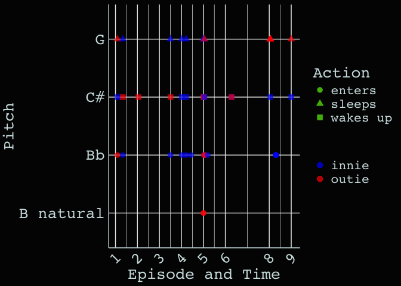

<!-- README.md is generated from README.Rmd. Please edit that file -->

# mdr

<!-- badges: start -->
<!-- badges: end -->

The goal of mdr is to provide data from the Severance TV show.

## Installation

You can install the development version of mdr like so:

``` r
devtools::install_github("LucyMcGowan/mdr")
```

## Example

``` r
library(mdr)

df <- elevator_dings |>
  dplyr::mutate(time_in_minutes = as.numeric(time) / 3600) |>
  dplyr::mutate(episode_time = episode + time_in_minutes / 100) |>
  dplyr::filter(!is.na(pitch), !is.na(io))

library(ggplot2)

ggplot(df, aes(x = episode_time, y = pitch, color = io, shape = action)) +
  geom_point(size = 3, alpha = 0.5) +
  scale_shape_manual(values = c("enters" = 16, "sleep" = 17, "wakes up" = 15)) +
  scale_color_manual(values = c("blue", "red")) +
  scale_x_continuous("Episode and Time",
                     breaks = unique(df$episode),
                     labels = unique(df$episode)) +
  labs(
    y = "Pitch",
    color = "",
    shape = "Action"
  ) +
  theme_minimal() +
  theme(axis.text.x = element_text(angle = 45, hjust = 1),
        panel.grid = element_blank())
```


